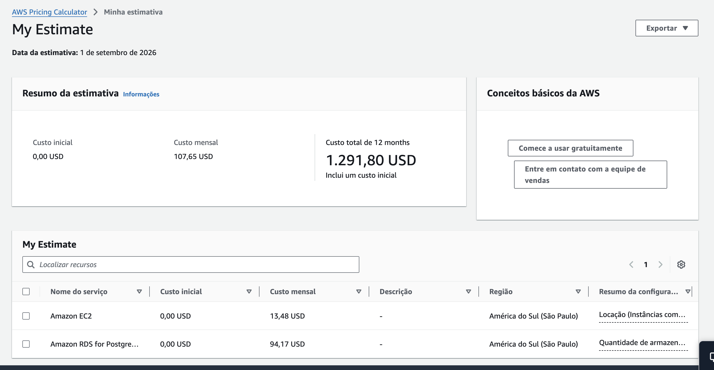
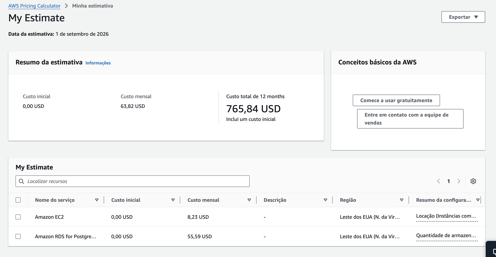

# Relatório de Entrega — Fase 1 — ToggleMaster

> Tech Challenge · POSTECH DCLT · Cultura DevOps, Arquitetura Cloud e AWS

## Participantes

- Wesley Ferreira de Oliveira — rm376487
- Thiago Ferreira Rodrigues — rm376442

## Links

| Item | Link |
|---|---|
| Documentação técnica (monolito, 12-Factor, arquitetura, custos) | [`docs/ANALISE-ARQUITETURA.md`](../docs/ANALISE-ARQUITETURA.md) |
| Diagrama de arquitetura | https://claude.ai/code/artifact/7876d085-66fd-46ad-a08b-6fbb79aead41 |
| Estimativa de custo — sa-east-1 (São Paulo) | https://calculator.aws/#/estimate?id=64ccbc1e1057357bc1dc88a10a028a4d2f7cea00 |
| Estimativa de custo — us-east-1 (N. da Virgínia), região escolhida | https://calculator.aws/#/estimate?id=587162758a89feffe6299186aeac1fd6c3f3493e |
| Vídeo de demonstração | [Preencher após gravação] |
| Repositório | https://github.com/dougls/toggle-master-monolith |

## Resumo executivo

A aplicação monolítica `toggle-master-monolith` foi executada localmente via Docker Compose, analisada quanto à sua natureza monolítica e aderência aos 12 Fatores, e implantada na AWS (região `us-east-1`) seguindo o diagrama de arquitetura: uma VPC com sub-redes pública e privada, EC2 rodando a API e RDS PostgreSQL isolado na sub-rede privada, com Security Groups restringindo o tráfego pelo princípio do menor privilégio. A stack foi validada de ponta a ponta — CRUD completo de feature flags via IP público, com a API conectada ao RDS.

## Infraestrutura provisionada

| Recurso | Valor |
|---|---|
| Região | `us-east-1` (N. da Virgínia) — escolhida por custo (~41% mais barata que `sa-east-1`) |
| VPC | `10.0.0.0/16` |
| Sub-rede pública | `10.0.1.0/24` (us-east-1a) |
| Sub-rede privada | `10.0.2.0/24` (us-east-1a) + `10.0.3.0/24` (us-east-1b, exigida pelo DB Subnet Group) |
| EC2 | `t3.micro`, Amazon Linux 2023, IP público, `sg-ec2-app` |
| RDS | PostgreSQL 13.23, `db.t3.micro`, Single-AZ, 20 GB gp3, privado, `sg-rds-db` |
| Processo da app | `systemd` (`togglemaster.service`), não foreground de SSH |
| Provisionamento | AWS CLI, a partir de um usuário IAM dedicado (`togglemaster-cli`, não root) |

## Estimativa de custos AWS 

##### Estimativa de custo — sa-east-1 (São Paulo)


##### Estimativa de custo — us-east-1 (N. da Virgínia)


## Validação (executada de fora da AWS, via IP público)

```
GET  /health                                        → {"status":"ok"}
POST /flags {"name":"tech-challenge-fase1", ...}     → 201 "criada com sucesso"
GET  /flags                                          → [{"name":"tech-challenge-fase1","is_enabled":true}]
GET  /flags/tech-challenge-fase1                     → {"is_enabled":true,"name":"tech-challenge-fase1"}
```

Confirma o fluxo completo do diagrama: cliente → Internet Gateway → EC2 (`sg-ec2-app`) → RDS (`sg-rds-db`, aceitando apenas tráfego originado do Security Group da EC2).

## Desafios encontrados e decisões tomadas

1. **Conflito de porta local.** No macOS, a porta 5000 já estava em uso pelo AirPlay Receiver (`ControlCenter`). Decisão: remapear `docker-compose.yaml` para `5050:5000` em vez de desativar uma feature do sistema operacional.
2. **Nome de Security Group reservado.** A AWS rejeita nomes de grupo começando com `sg-` (prefixo reservado para os IDs gerados automaticamente). Decisão: usar `togglemaster-ec2-app` / `togglemaster-rds-db` como nome real do recurso, mantendo `sg-ec2-app` / `sg-rds-db` como tag `Name` para bater com a nomenclatura do diagrama.
3. **RDS exige 2 AZs mesmo em Single-AZ.** Um DB Subnet Group precisa de sub-redes em pelo menos duas Availability Zones, mesmo para uma instância Single-AZ. Decisão: criar uma segunda sub-rede privada (`10.0.3.0/24`, us-east-1b) apenas para satisfazer esse requisito técnico — o banco continua rodando em uma única AZ.
4. **Inicialização do banco não é automática fora do Docker.** O `entrypoint.sh` roda `flask init-db` automaticamente a cada start do container, mas o deploy manual (venv + systemd) não passa por esse script. Decisão: rodar `flask init-db` manualmente uma vez, logo após o RDS ficar disponível — sem isso, a tabela `flags` simplesmente não existiria.
5. **SG pede 80/443, app escuta em 5000.** A aplicação não tem proxy reverso — hoje ela expõe a porta 5000 diretamente. Decisão: liberar também a porta 5000 no `sg-ec2-app`, documentando como simplificação da Fase 1 (Nginx ou um ALB para expor 80/443 de verdade fica como melhoria para uma fase futura).
6. **Gunicorn em foreground morre com a sessão SSH.** É o gap de *Disposability* já identificado na análise de 12-Factor. Decisão: substituir por um serviço `systemd` (`togglemaster.service`, `Restart=on-failure`), que sobrevive a desconexões e reinicia sozinho em caso de falha.
7. **Trade-off de custo por região.** A mesma arquitetura custa U\$ 107,65/mês em `sa-east-1` (São Paulo) contra U\$ 63,82/mês em `us-east-1` — a diferença está quase inteiramente no RDS. Decisão: usar `us-east-1` para minimizar custo, já que latência para o Brasil não é uma restrição real neste MVP de validação.
8. **Gestão de credenciais do banco.** A senha do RDS foi gerada aleatoriamente (`openssl rand`), nunca hardcoded no código. Ela é distribuída para a EC2 via `scp` para um arquivo `.env` (`chmod 600`), carregado pelo `systemd` via `EnvironmentFile` — nunca versionado no Git (`*.env` está no `.gitignore`).

## Segurança

- Usuário IAM dedicado (`togglemaster-cli`) para o provisionamento, em vez de credenciais da conta root — chave de acesso a ser revogada após a avaliação.
- `sg-rds-db` referencia `sg-ec2-app` como origem (não um CIDR) — o RDS nunca aceita conexão de nenhum outro host, mesmo dentro da própria VPC.
- RDS provisionado com `--no-publicly-accessible`, na sub-rede privada, sem rota para a internet (sem NAT Gateway).
- SSH (`22`) liberado apenas para o `/32` do IP do administrador, não `0.0.0.0/0`.

## Encerramento dos recursos

Ao final da avaliação desta fase, os recursos abaixo devem ser removidos/desligados para evitar custos contínuos (a infraestrutura pode ser recriada a qualquer momento com os mesmos comandos usados aqui):

- Instância RDS `togglemaster-db` (deletar ou parar — lembrando que instâncias RDS paradas voltam a rodar automaticamente após 7 dias)
- Instância EC2 `togglemaster-app` (terminar)
- Security Groups, sub-redes, route tables, Internet Gateway e VPC (deletar, nessa ordem de dependência)
- Chave de acesso do usuário IAM `togglemaster-cli` (desativar/remover)
